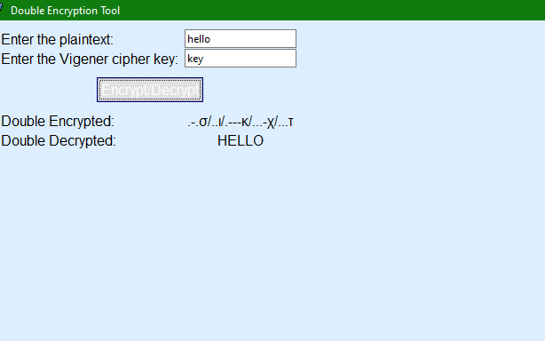

Crypotography Labs in Python that I have performed during my Network Security course in University.

Project:We've developed a double encryption tool using Python. We apply two algorithms, Morse and Vigenère cipher. First, the plaintext undergoes encryption using the Vigenère cipher, and then the output is further encrypted using the Morse code. In addition, we've implemented a Tkinter frontend for user interaction.
Demo:

